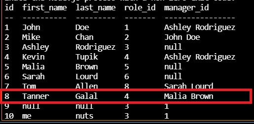

# EmployeeCorral
# Title
EmployeeCorral

# Description:
I was tasked with creating a node.js app that allows a business owner to view and manage the departments, roles, and employees in their company so that they can organize and plan their business.

# Usage:
The before image of the line in employee table that will be updated.

This is the image of after the role_id is updated from 4 to 7.

# Contributions:
Patrick Sebstead

# Questions:
github username: RaiderNationBuilder

If you have any questions about this project you can reach me at the following email address: sebstead@yahoo.com

githuyb repo: https://github.com/RaiderNationBuilder/EmployeeCorral